# 次世代シーケンスデータベースの使い方

情報・システム研究機構  
データサイエンス共同利用基盤施設  
ライフサイエンス統合データベースセンター  

Database Center for Life Science (DBCLS),  
Joint Support-Center for Data Science Research,  
Research Organization of Information and Systems (ROIS)

大田達郎  
Tazro Ohta  
t.ohta@dbcls.rois.ac.jp

Prepared for AJACS62(AJACS京都2)  
September 2, 2016

----

これは統合データベース講習会 AJACS62 (AJACS京都2)「次世代シーケンスデータベースの使い方」の資料です。オンラインで閲覧することを想定しており、テキスト中にハイパーリンクが埋め込まれている箇所があります。また、随時アップデートをしていますので、最新版は http://github.com/inutano/training からご覧ください。  

講習会のお知らせとプログラム、各講習の資料へのリンクは[こちら](http://events.biosciencedbc.jp/training/ajacs62)です。

----

## 概要

本講習では、主に新型DNAシーケンサー (High-Throughput Sequencer, HTS) から得られる塩基配列データと、それに基づく生物学的データを公開しているデータベースの概要、およびデータベースからのデータの取得の手順を学びます。

----

## 講習の流れ

今回の講習では、以下の内容について説明します。

- 新型シーケンサーとは
  - 定義
  - どのように使われているか
  - 機器について
  - シーケンシング・アプリケーションについて
  -	得られるデータについて
-	新型シーケンサーのデータベースとは
  - データが登録されるまで
  - 一次データレポジトリ
  - 二次データを含むデータベース
-	データ解析についてのTips

ハンズオンの課題はありませんが、ブラウザを使って実際にデータベースにアクセスしてもらうと、より理解が深まります。実際の講習では、デモを交えながら説明します。

----

## 新型シーケンサーとは

### 定義

講習のタイトルには「次世代シーケンサー」と書いていますが、現存するので「次世代」ではありません。「超並列シーケンス」、「新型シーケンス」とも呼ばれます。「次世代」は、いわゆる[バズワード](https://ja.wikipedia.org/wiki/バズワード)なので、明確な定義は存在しませんが、「サンガー法以降、2000年代中頃から登場した、新しいDNAシーケンス技術の総称」という理解で問題ありません。新型シーケンサーとして含まれるのは

- Illumina
- IonTorrent
- Roche 454
- PacBio RS
- SOLiD

などのシーケンサーベンダー・ブランドによって提供する技術に代表されます。新型シーケンサーの測定技術の詳細については、次の文献を参照してください。

[Goodwin, Sara, John D. McPherson, and W. Richard McCombie. "Coming of age: ten years of next-generation sequencing technologies." Nature Reviews Genetics 17.6 (2016): 333-351.](http://www.nature.com/nrg/journal/v17/n6/full/nrg.2016.49.html)

### どのように使われているか

新型シーケンサはサンプルDNAを入力として処理し、DNA塩基配列をデータとして出力します。出力されたデータは断片化された塩基配列(リード)の集合であり、そのままでは生物学的な解釈ができません。新型シーケンサのデータを研究に利用するためには、リードを元の塩基配列に復元する必要があります。復元された塩基配列に対して、多型検出や発現量推定など、目的に応じた特徴抽出、注釈付けを行ったのち、サンプル間での統計検定を行うことで、研究データとしての解釈が可能になります。

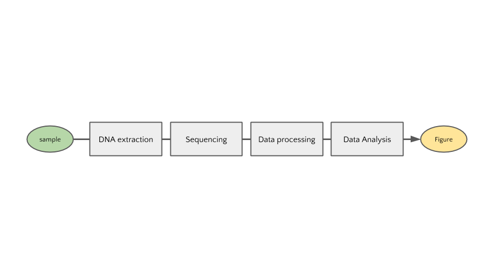

この講習では、シーケンサから出力された生のデータ (primary data, 一次データ) に生物学的な注釈付を行うまでを「データ処理」、その後の統計処理などを「データ解析」と呼び分けています。人によっては両者をまとめて「データ解析」と呼ぶ場合もあります。ソフトウェアによってはデータ処理とデータ解析を一括で行うものもあります。

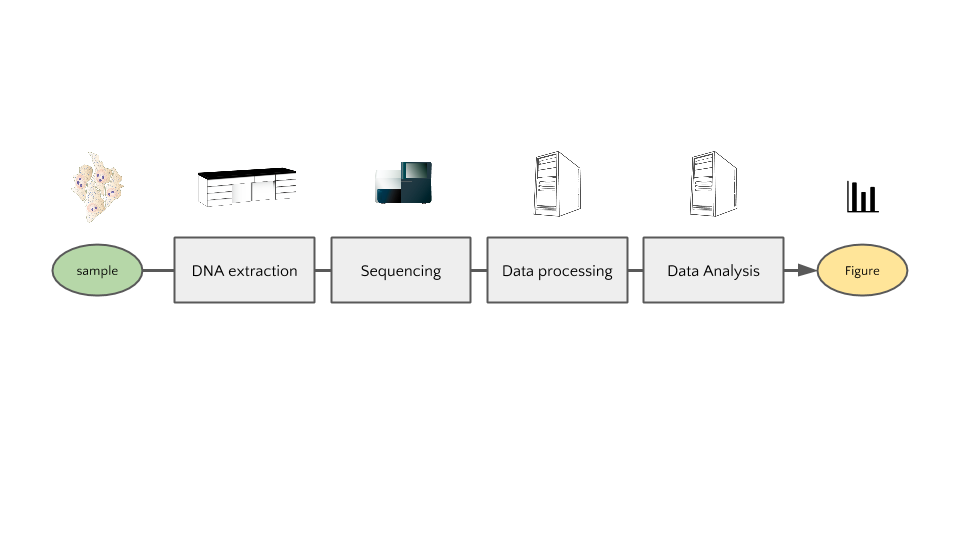

サンプルからDNAを抽出するまではベンチワークです。単にゲノムDNAを抽出する場合もあれば、ゲノムDNAを処理して部分的に抽出したり、サンプルから抽出したRNAをDNAに逆転写したものをシーケンサーに入力として与えることもあります。詳しくは後述の「シーケンシング・アプリケーションについて」を参照してください。シーケンサーから出力されたデータから、プロットや表などの結果データを生成するまでの過程はコンピュータ上の操作が必要です。新型シーケンサーから得られるデータは一般にデータサイズが大きいため、従来のサンガーシーケンサーとは扱いが異なりますが、必要とされる計算機のスペックはサンプルの数、データのサイズ、サンプル生物種のゲノムサイズなどの要因によって異なります。

### シーケンサー機器について

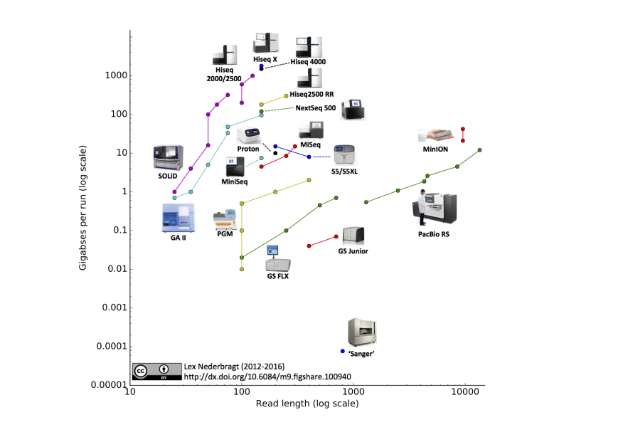

新型シーケンサーから得られる塩基配列データのリードの長さや量は、機器と試薬のアップデートによって年々変化しています。また、コストあたりに得られるデータ量も変化しています。上の図は2016年7月時点でのシーケンサー各社の公称スペックをプロットしたものです (引用: Developments in high throughput sequencing – July 2016 edition, https://flxlexblog.wordpress.com/2016/07/08/developments-in-high-throughput-sequencing-july-2016-edition/ )。新型シーケンサーのデータを得る、もしくはデータベースに登録されたデータを利用するためには、機器の違いを理解し、目的に応じて選択する必要があります。

### シーケンシング・アプリケーションについて

DNA抽出の方法を工夫することで、新型シーケンサーの高い並列度を活かした様々な分子の計測を行うことができます。前述の通り、全ゲノムDNAを与える場合 (Whole Genome Sequencing, WGS) やエクソン領域を増幅するキットを利用した Exome シーケンス、転写物をキャプチャして逆転写したDNAをシーケンスする RNA-Seq 、chromatin immunoprecipitation によって得られたDNA領域をシーケンスする ChIP-Seq などその種類は非常に多岐に渡ります。

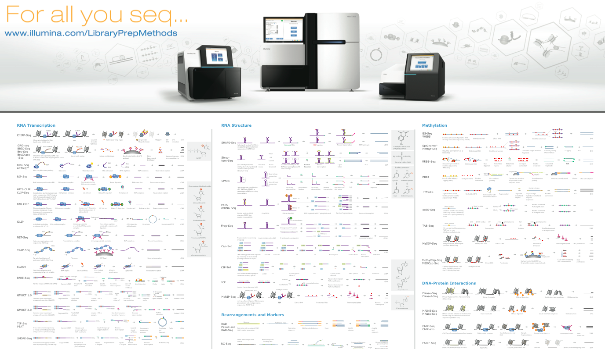

アプリケーションの詳細を知るためには、手法についての論文を当たることが最も確実です。次の資料は Illumina 社によってまとめられたものです。

[Sequencing Methods Review - A review of publications featuring Illumina® Technology](http://www.illumina.com/content/dam/illumina-marketing/documents/products/research_reviews/sequencing-methods-review.pdf)

それぞれのシーケンシング・アプリケーションにおける実験手技およびデータ処理・解析については、[次世代シークエンス解析スタンダード〜NGSのポテンシャルを活かしきるWET&DRY](http://www.amazon.co.jp/dp/4758101914/ref=cm_sw_r_tw_dp_40sGub0Q8C567)という書籍にもまとめられています。各シーケンス・アプリケーションがライブラリ調製から丁寧に解説してあり、非常に参考になります。新型シーケンサーについて日本語の情報が必要な場合はまずこの一冊を購入しましょう。

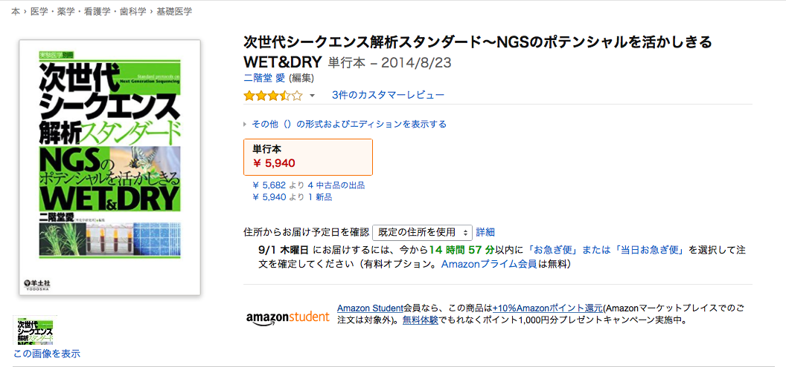

----

## 新型シーケンサーのデータベースとは

### データが登録されるまで

シーケンサーから得られたデータはデータ処理、データ解析を経て可視化され、可視化されたデータは論文あるいは何かしらのアウトプットの一部となることが一般的です。

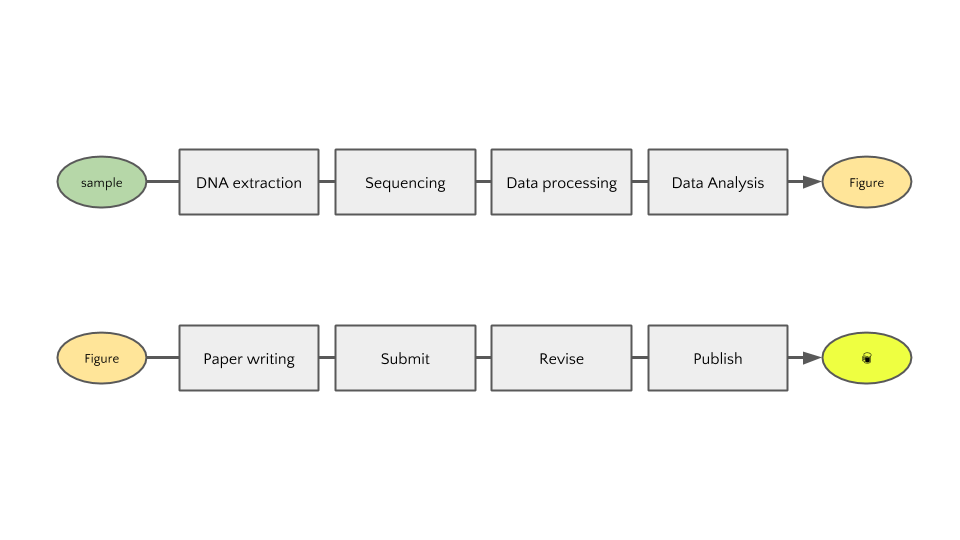

しかし、現在ではほとんどの論文誌において、論文に用いた一次データ (つまりシーケンサから得られたデータ処理前のデータ) は *投稿前に* 公共データレポジトリに登録してアクセッション番号を取得する必要があります。

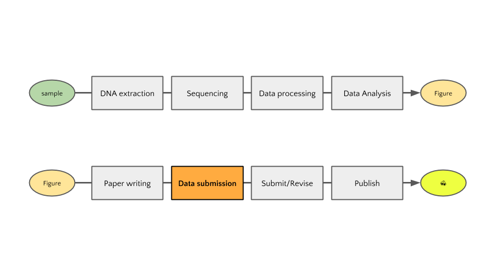

配列データを公共データレポジトリのサーバに送信し、サンプルやシーケンス実験についてのメタデータをガイドラインに従って記述する必要があります。つまり、発表された論文で使われたデータは (理想的には) その全てがオンラインで公開されていることになります。

配列データの登録は思っているよりも大変です。日本の登録窓口である [DDBJ](http://trace.ddbj.nig.ac.jp/dra/index.html) では専門のアノテーターが登録作業を補助してくれますが、数日かかることもあります。論文投稿前ではなく、データ解析や処理をする前の余裕のある時に登録しておきましょう。登録後はすぐに公開されるわけではなく、任意の期間 (原則2年間) プライベートにしておくことができます。

### 一次データレポジトリ

新型シーケンサーから得られたデータは個人を特定可能な情報を含むヒトデータとそれ以外に分けられ、データレポジトリに登録されます。

#### Open Access Data

ほとんどの場合、個人特定可能な情報を含むヒトデータ以外のデータは全て Sequence Read Archive (SRA) への登録を指定されます。 SRA は International Nucleotide Sequence Database Collaboration (INSDC) によって運用されています。INSDCに参加しているのは米国の National Center for Biotechnology Information (NCBI), 欧州の European Bioinformatics Institute (EBI), 日本の DNA Data Bank of Japan (DDBJ) の3つの機関です。

3つの機関はそれぞれが独自にデータの登録・検索のシステムを公開・運用していますが、登録されたデータは3つの機関で交換され共有されています。

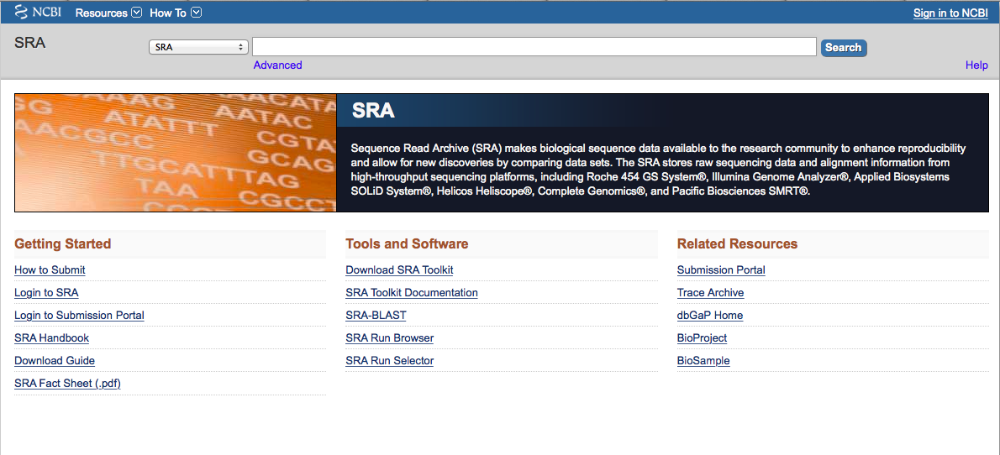

[NCBI SRA - www.ncbi.nlm.nih.gov/sra](http://www.ncbi.nlm.nih.gov/sra)

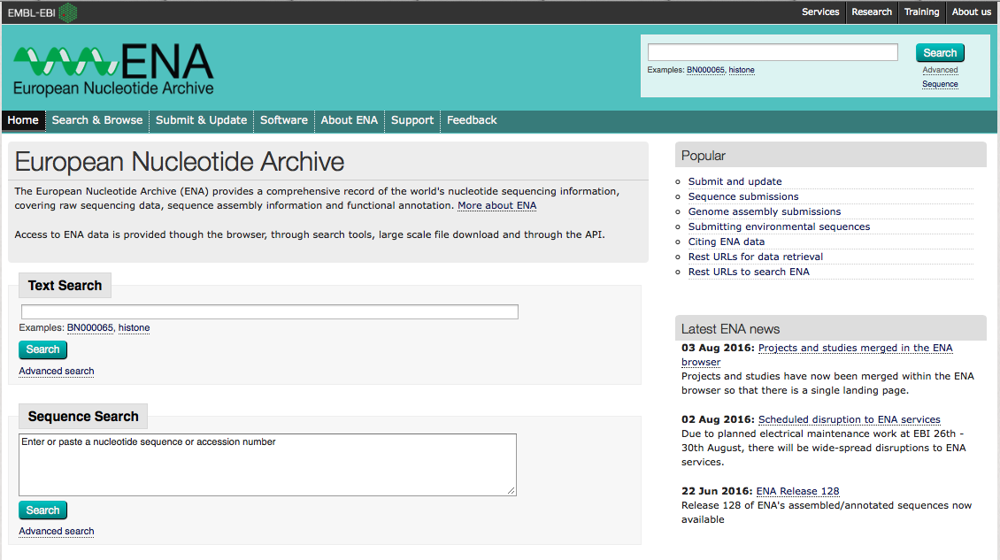

[EBI ENA - ebi.ac.uk/ena](http://ebi.ac.uk/ena)

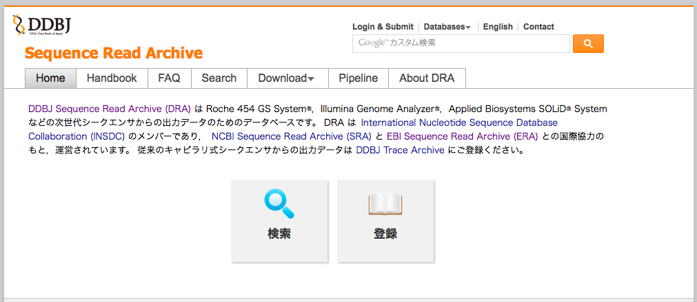

[DDBJ DRA - trace.ddbj.nig.ac.jp/dra](http://trace.ddbj.nig.ac.jp/dra)

#### Controlled Access Data

配列データやメタデータにサンプルを提供した個人が特定可能な情報が含まれている場合には、データアクセスに許可が必要なデータ、すなわち controlled access データとなります。アクセスするための許可を得る方法は、登録されているデータレポジトリ、およびデータセットごとに異なります。また、 fastq データではなく変異情報のサマリーデータのみが登録される場合もあります。

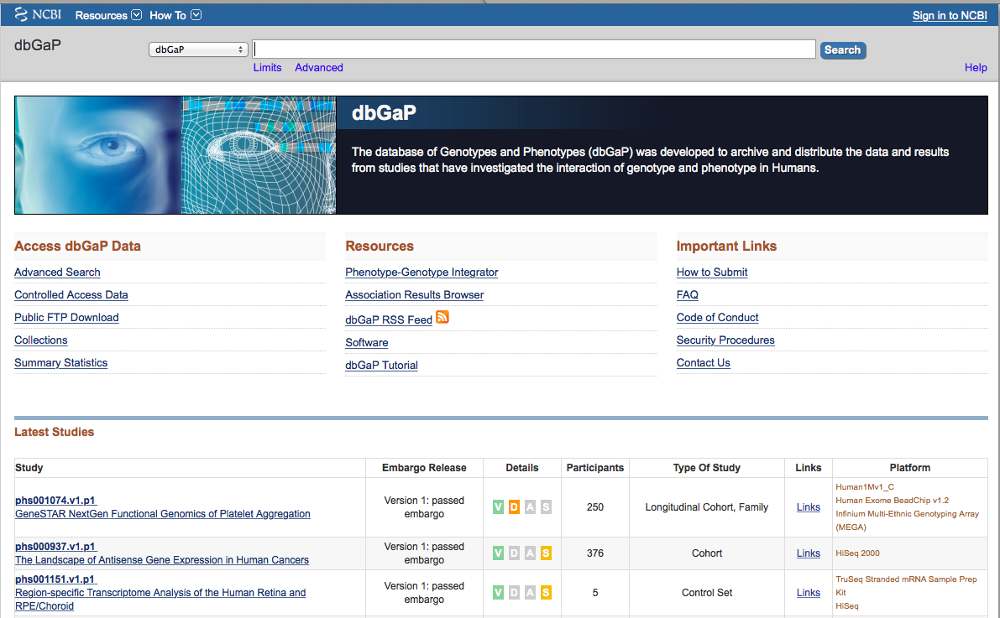

[NCBI dbGaP - www.ncbi.nlm.nih.gov/gap](https://www.ncbi.nlm.nih.gov/gap)

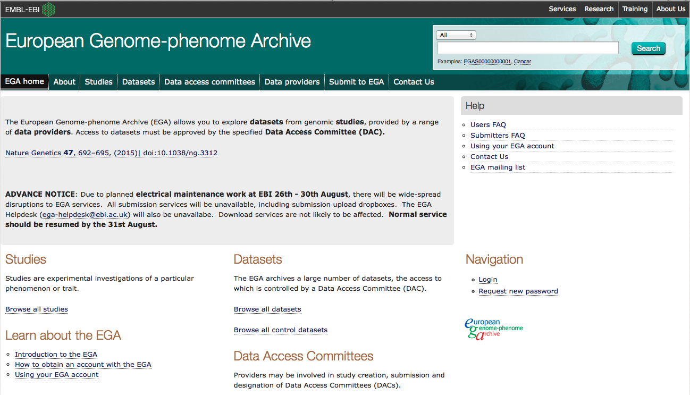

[EBI EGA - www.ebi.ac.uk/ega/](https://www.ebi.ac.uk/ega/)

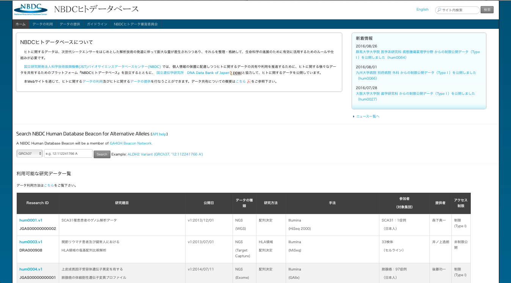

[NCBI JGA - humandbs.biosciencedbc.jp](http://humandbs.biosciencedbc.jp)

### 二次データを含むデータベース

SRAに登録されたデータを再利用したい場合には、データをダウンロードしたのち、データ処理・データ解析を行う必要があります。データ処理に用いられるソフトウェアの利用法を解説する書籍やウェブサイトも増え(後述します)、データ処理や解析の敷居は低くなっています。しかし、SRAに登録されたデータを予め処理したものや、それに基づく解析の結果を公開するデータベースも増えています。また、国際コンソーシアムなどによって行われる大型プロジェクトでは、プロジェクトのウェブサイトを通じて解析済みデータを公開している場合があります。

#### ChIP-Atlas

[ChIP-Atlas](http://chip-atlas.org) は 九州大医学部 発生再生研究室 と DBCLS によって開発・運用されているデータベースです。SRAで公開された ChIP-Seq, DNase-Seq のデータに定型処理を行い、その結果データに基いて様々な解析結果を公開しています。

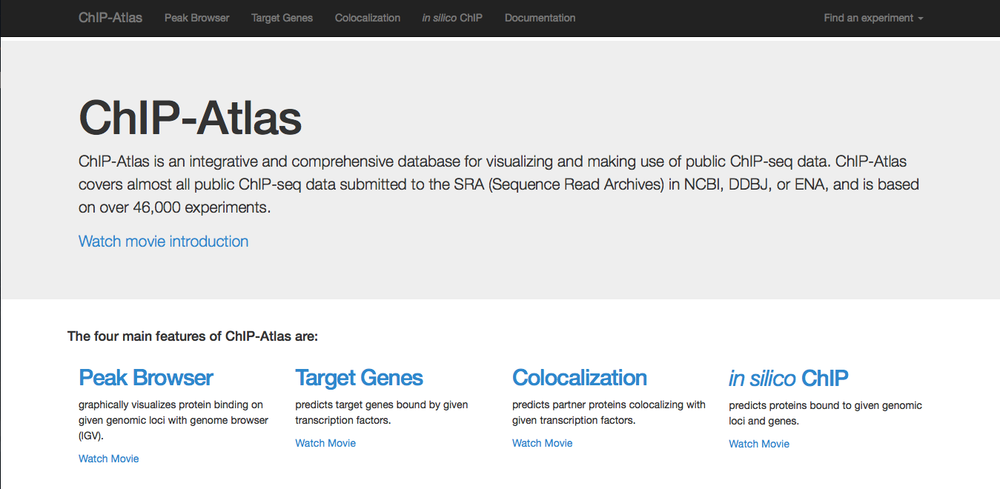

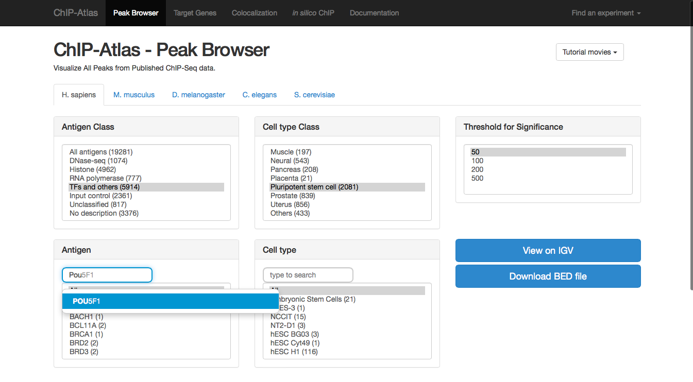

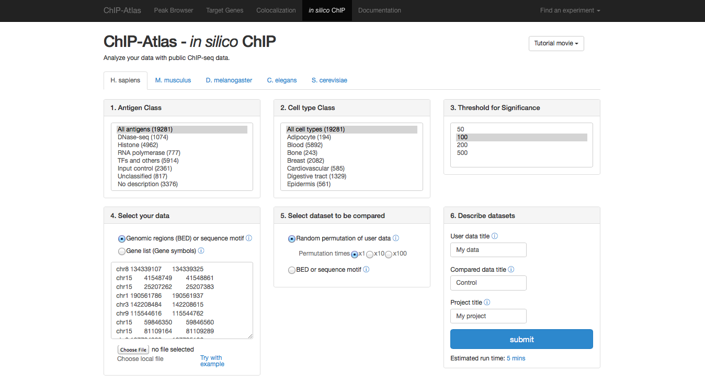

#### MicrobeDB.jp

[MicrobeDB.jp](http://microbedb.jp/) は統合データベースプロジェクト・微生物統合データベースによって開発・運用されているデータベースです。SRAで公開されている メタ16S、メタゲノム、メタトランスクリプトームなどのデータの解析データが蓄積されており、ブラウザ上で可視化することができます。

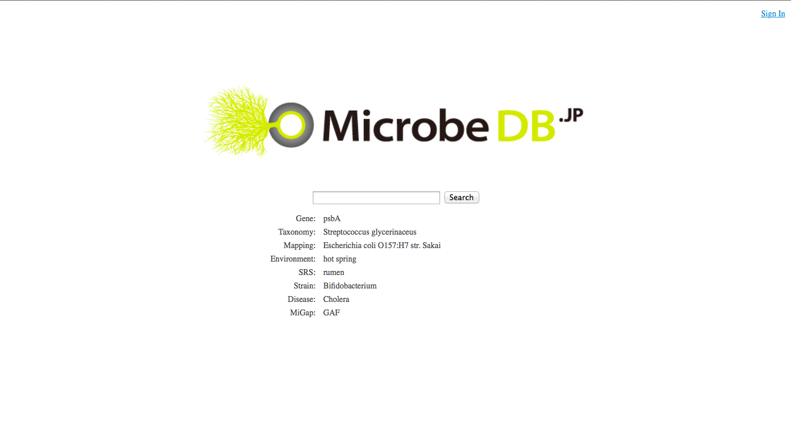

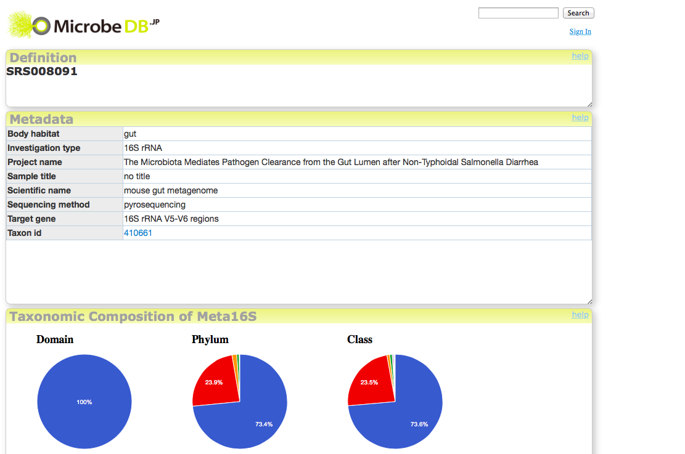

----

## データ解析についてのTips

解析済みのデータの共有が進み簡単にデータを二次利用することができるようになっています。しかし、データによっては解析データが存在しなかったり、特定のソフトウェアの結果が必要な場合もあります。その場合は、SRAなどの一次データレポジトリからデータをダウンロードして自身で解析する必要があります。

コンピュータを用いたデータ解析に不慣れな方向けに、多くの教材や書籍、講習会などがあります。自分のデータを自分で解析してみたいという場合には、以下を参考にしてみてください。

- 統合データベース講習会
  - 講習資料と公園動画が [統合TV - togotv.dbcls.jp](http://togotv.dbcls.jp) から公開されています。
- NGSハンズオン講習会
  - http://biosciencedbc.jp/human/human-resources/workshop/h28-2
- DDBJが提供するオンラインの解析サービスの使い方
  - [Pipeline Tutorial](http://www.ddbj.nig.ac.jp/search/help/pipeline-tutorial-j.html)
  - [統合TV](http://togotv.dbcls.jp/ja/)
      - [今日からはじめるDDBJ Read Annotation Pipeline](http://togotv.dbcls.jp/20100617.html)
      - [DDBJ Read Annotation Pipelineによるde novo Assembly解析](http://togotv.dbcls.jp/20110226.html#p01)
  - [DDBJパイプラインとGalaxyによるデータ解析](https://github.com/inutano/training/tree/master/ajacs51)
- 書籍: [次世代シークエンサーDRY解析教本 (細胞工学別冊)](https://www.amazon.co.jp/dp/4780909201)

----

## 以上で終了です！

おつかれさまでした！
